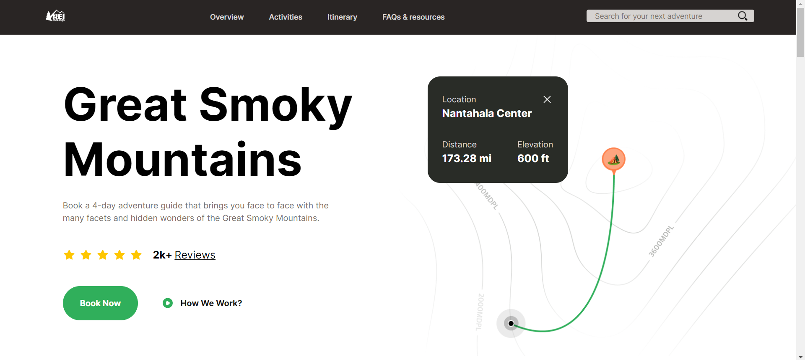
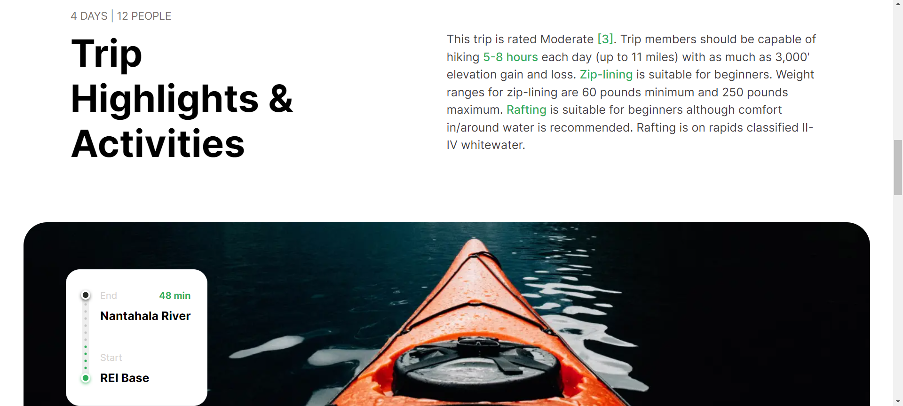
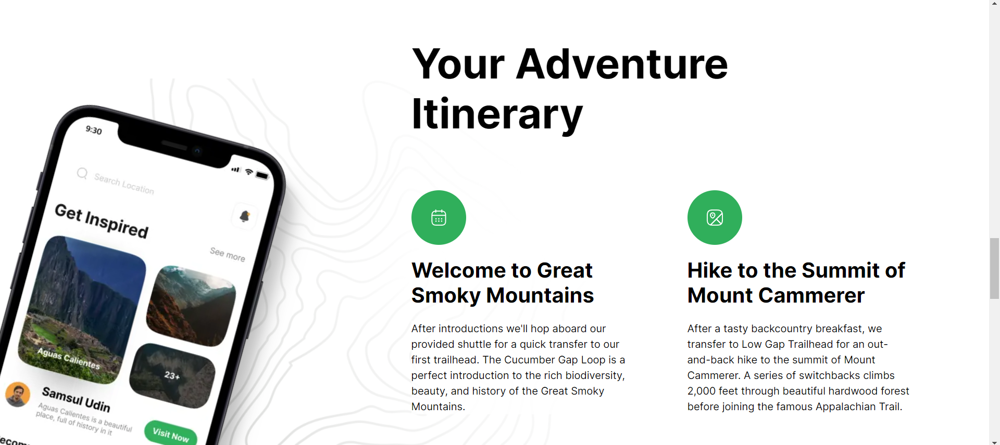
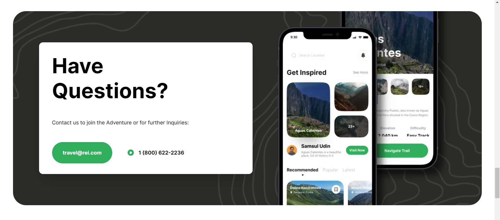

# REI Landing Page

This repository contains the source code for a subpage of REI (Recreational Equipment, Inc.) Adventures, a leading outdoor retailer providing gear and expertise for various outdoor activities.



# NextJS + ReactJS + Tailwind

This is a [Next.js](https://nextjs.org/) project bootstrapped with [`create-next-app`](https://github.com/vercel/next.js/tree/canary/packages/create-next-app).

## Getting Started

First, run the development server:

```bash
npm run dev
# or
yarn dev
# or
pnpm dev
# or
bun dev
```

Open [http://localhost:3000](http://localhost:3000) with your browser to see the result.

You can start editing the page by modifying `app/page.tsx`. The page auto-updates as you edit the file.

## Features
- **Responsive design:** The landing page is designed to be fully responsive, ensuring optimal viewing and interaction experiences across devices of all sizes.
- **Visually Engaging:** The layout of the booking page is carefully crafted to be visually appealing, with high-quality imagery showcasing the Smoky Mountain retreat.
- **Modern UI:** Inspired by REI's design language, the landing page offers a modern user interface booted with Tailwind CSS.

## Implementation

### Activities Preview


### Itinerary


### FAQ

